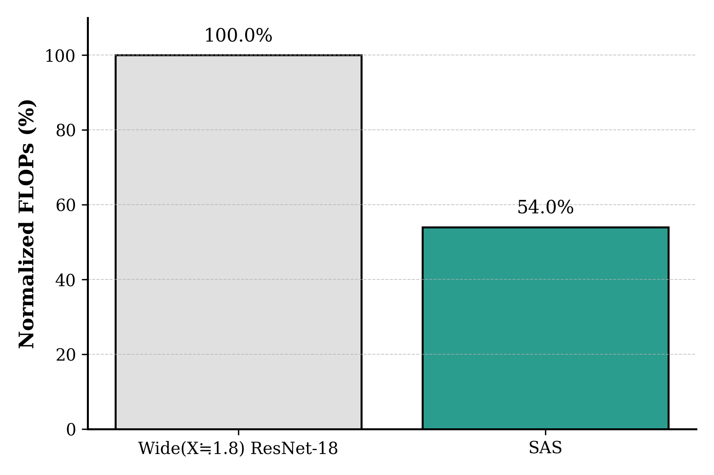

# SAS: Structured Activation Sparsification
This is the official repo for ICLR 2024 Paper "SAS: Structured Activation Sparsification"
Yusuke Sekikawa and Shingo Yashima

[paper](https://openreview.net/pdf?id=vZfi5to2Xl), [openreview](https://openreview.net/forum?id=vZfi5to2Xl)

## Overview
 


SAS expands representational capacity by projecting inputs into a higher-dimensional, structured-sparse space.This is equivalent to selecting the appropriate weights depending on its input—thereby improving accuracy without increasing FLOPs.

## 

<p align="center">
  
</p>

All models were trained on the ImageNet dataset under the following common settings:

- **Loss function:** Distillation loss  
- **Data augmentation:** AutoAugment  
- **Batch size:** 256  
- **Learning rate scheduler:** Cosine annealing  
- **Optimizer:** SGD (momentum=0.9, weight decay=1e-4)

※ Wide ResNet-18 refers to a model that has twice as many parameters as ResNet-18.

## 
### Computation 

<p align="center">
  
</p>

- SAS achieves a 46.0% reduction in FLOPs at a fixed Top-1 accuracy.
  - The SAS FLOPs value shown was computed by linearly interpolating its Top-1 accuracy between ResNet-18 and Wide ResNet-18.

## 
### Accuracy 

<p align="center">
  
</p>

- SAS increases Top-1 accuracy by 2.63% at the same FLOPs.


---

## Run
### 1. Train standard ResNet-18
```bash
python train.py <TRAIN_DATA_DIR> <VAL_DATA_DIR>
```
### 2. Train ResNet-18 with SAS
```bash
python train.py <TRAIN_DATA_DIR> <VAL_DATA_DIR> --use_sas
```
### 3. Train Wide ResNet-18
```bash
python train.py <TRAIN_DATA_DIR> <VAL_DATA_DIR> --arch wide_resnet18
```
### 4. Train Wide ResNet-18 with SAS
```bash
python train.py <TRAIN_DATA_DIR> <VAL_DATA_DIR> --use_sas --arch wide_resnet18
```

---

## Citation
If you find our code or paper useful, please cite the following:
```
@inproceedings{
sekikawa2024sas,
title={{SAS}: Structured Activation Sparsification},
author={Yusuke Sekikawa and Shingo Yashima},
booktitle={The Twelfth International Conference on Learning Representations},
year={2024},
url={https://openreview.net/forum?id=vZfi5to2Xl}
}
```
